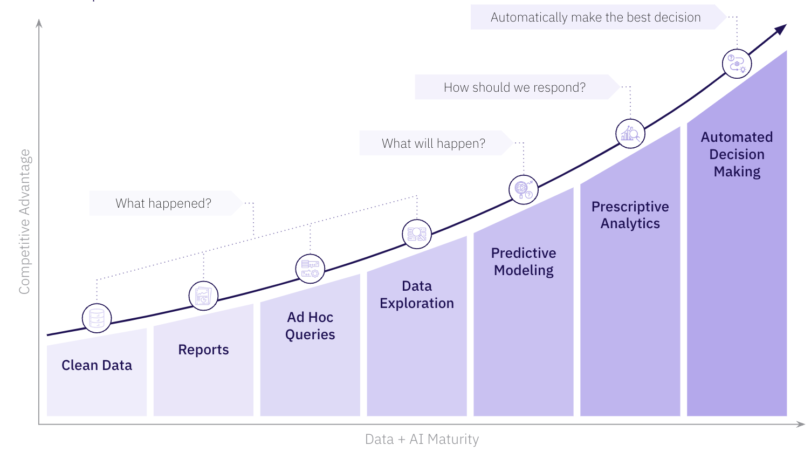
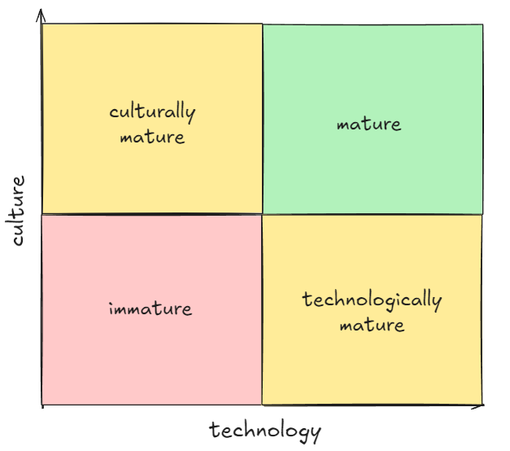

# Data platform and data maturity

## Introduction

## A typical data maturity chart - the what

Frequently, data maturity is discussed only from a high-level **what** perspective, which is akin to discussing an illness by only looking at its symptoms. You might see a chart such as this:

While roughly correct, this provides no insight as to what data maturity actually means in practical terms, and more importantly, **how** to achieve higher maturity levels.

It's important to remember that technology never exists in isolation from culture. Therefore, to utilize it fully, it must be part of business strategy and structure. In fact, according to [Conway's Law](https://en.wikipedia.org/wiki/Conway%27s_law), it's impossible to implement and utilize tooling without proper organization structure and culture in place.

Data maturity is a function of a company's technical and cultural development in the domain of analytics:

$$
\begin{aligned}
maturity=f(technology, culture)
\newline
{(technology, culture)\in Analytics}
\end{aligned}
$$

Another way to visualize this relationship:

Hopefully, we've managed to illustrate that it's impossible to just buy one's way into data maturity, eg. by purchasing latest & greatest technological solutions. Similarly, it's impossible to just will ones way into it: it's possible to run without shoes, but barely running is not the same as competing in running events. Data maturity is a function of both technology and culture, and reaching a high level of analytical maturity requires strategic investment in both areas.

## dyvenia way - the how

### Technology

### Culture

#### Team topologies

Below we will look at the organizational structure required for a company to utilize a data platform effectively. We will point out the strengths and weaknesses of each of the main structures.

We will discuss models in order. We will start from the ones requiring the least, and move to ones requiring the most data maturity to implement successfully.

##### Centralized

The centralized model is the way most enterprises have traditionally structured their analytics. In this model, analytics, including the data platform (its implementation and support, access management, data governance, feature development, maintenance, etc.) is managed by a single, centralized team.

##### Decentralized

In the decentralized model, each team is responsible for its own data platform and processing. This model is often seen in smaller companies or startups, where the data platform is not yet a priority. In an enterprise setting, such model can lead not only to massive waste of resources and duplication of effort, but also to security and governance issues.

We still frequently see this model in large companies in which the data platform is not yet a priority. It is typically used unofficially alongside the centralized model, where centralized teams become a bottleneck*, leading to the rise of shadow analytics.

*As we will discuss [below](#data-mesh), centralized data teams and platforms do not inherently result in bottlenecks, but frequently become ones depending on the details of a specific data platform implementation (which includes, as we have learned, organizational structure and culture).

##### Hub and spoke

The hub and spoke model is a hybrid of the centralized and decentralized models. In this model, a centralized team is responsible for the data platform, but each team has a data engineer, analyst or data scientist assigned. This person is responsible for (or helping with) data processing and analysis within their team.

This model is popular within companies with a relatively, bot not fully mature data analytics. The "spoke" is still required due to either insufficient development of the data platform, insufficient data literacy within the teams, or both.

##### Data mesh

This is the newest organization model, proposed only in [2019](https://martinfowler.com/articles/data-monolith-to-mesh.html). It relies on a highly developed data platform and literacy within the company.

In this model, each team is responsible for its own data platform *instance*, and the centralized team is responsible for the data platform's underlying infrastructure and governance. This model requires the platform team to follow something along the lines of Jeff Bezos's famous [API mandate](https://konghq.com/blog/enterprise/api-mandate), where the platform team is responsible for providing an easy-to-use, well-documented, and reliable interface to their platform. However, in this case, the data platform is actually a "platform of platforms": it provides required tooling and golden paths for teams to be able to create their own *instances* of the data platform.

#### Mindset

##### Data-driven

If the company does not make decisions based on data, there will be little interest in high-quality tooling and processes around it. Low quality and manual processes will eventually creep in and the data platform will be underutilized, giving way to "shadow analytics".

##### Data trust

It's a bit of a chicken-and-egg problem - if the company does not trust the data, it will not make decisions based on it. If the company does not make decisions based on data, it will not invest in data quality and governance. Frequently, the solution is to build trust in data early on, during the platform's implementation phase.

Once the initial success is obtained, trust will follow, as the quality of data from a well-implemented platform will far outperform the quality of data obtained from manual or non-standardized processes.

##### Software developer mindset

###### Building things vs doing things

Software developer mindset is required to perform analytics in highly data-mature organizations. It includes adopting proven practices from the software development world: version control, code reviews, testing, and CI/CD. More importantly, however, it requires adopting the mindset of *building things*, rather than simply *doing things*. This is a crucial distinction: "building things" means that the process is repeatable, scalable, well-documented, and is or can easily be automated. "Doing things" means that the process can be manual, error-prone, undocumented, and not scalable.

The "building things" mindset is reflected in some of the more recent concepts in analytics, such as "data products" and "data contracts". These are simply ways of allowing the analytics department to work in a way that is more similar to the software development department.

#### Skillset

Related to the software developer mindset is the skillset required to implement and utilize a data platform effectively. In a data-mature organizations, all employees (not just the analytics teams) must improve their digital and data competencies.

##### Digital skillset

Digital skillset includes familiarity with key concepts such as version control, reproducibility, environments, testing, documentation, and data governance.

##### Data skillset

Data skillset includes working knowledge of BI tooling and visualization, as well as basic data analytics knowledge, such as familiarity with the basics of data types, data cleaning, data validation, etc.
