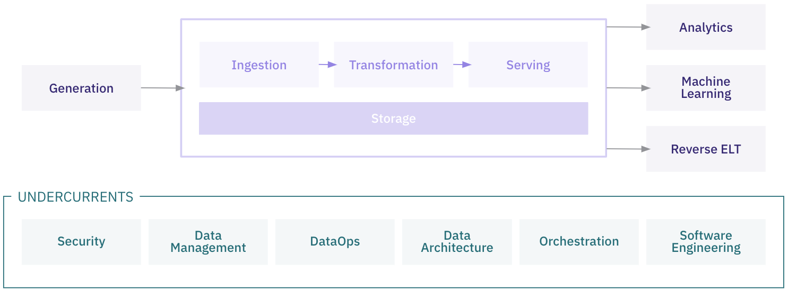

# Data Engineering Lifecycle

The data engineering lifecycle encompasses the various stages of designing, building, maintaining, and optimizing data pipelines that enable organizations to leverage data effectively. Each stage involves specific processes, tools, and best practices to ensure data flows smoothly, is transformed appropriately, and is accessible to stakeholders. The stages of the data engineering lifecycle are as follows:
- Generation
- Storage
- Ingestion
- Transformation
- Serving

The data engineering lifecycle is supported by several critical undercurrents, including security, data governance, DataOps, data architecture, orchestration, and software engineering practices. While these foundational concepts are integral to the success and scalability of data engineering workflows, they will not be covered in detail in this document. However, they remain crucial to our overall approach and should be considered throughout every stage of the lifecycle.



---

### 1. **Data Generation**

Data generation is the first step in the lifecycle, where raw data is created or collected from various sources. These sources can include user activity on applications, sensor data from IoT devices, logs from systems, and external APIs. The goal of this phase is to collect raw, unprocessed data that will be used in downstream processes.

```{=latex}
\newpage
```
#### Key Activities:
- **Event Logging**: Capturing user or system events.
- **IoT and Sensor Data**: Collecting data from physical devices.
- **API Requests**: Pulling data from external sources.
- **Manual Input**: Data entered by users or operators.

**Diagram Placeholder: Data Generation Process**


---

### 2. **Data Storage**

Data storage is the foundational component where all ingested and processed data is stored securely and durably. The choice of storage system depends on the volume, velocity, and type of data. Data can be stored in structured databases, semi-structured storage, or unstructured data lakes.

#### Key Activities:
- **Choosing Storage Systems**: Selecting between data warehouses, lakes, and object storage.
- **Partitioning and Indexing**: Organizing data for faster access.
- **Security and Compliance**: Ensuring data is encrypted and stored in compliance with regulatory requirements.

---

### 3. **Data Ingestion**

Data ingestion refers to the process of bringing generated data into your data infrastructure. This can be done in real-time or through batch processes. The goal is to move data from its source into a system where it can be stored and transformed.

#### Key Activities:
- **Streaming Ingestion**: Handling real-time data (e.g., Kafka, Pulsar).
- **Batch Ingestion**: Periodically importing data (e.g., using ETL tools).
- **API or File-Based Ingestion**: Pulling data from external services or systems via APIs or file transfers.

**Diagram Placeholder: Data Ingestion Pipeline**

---

### 4. **Data Transformation**

Data transformation is where the raw data is cleaned, structured, and enriched to make it suitable for analysis or other uses. This phase involves applying business logic, converting data formats, aggregating values, and removing noise.

#### Key Activities:
- **Data Cleaning**: Handling missing, duplicate, or erroneous data.
- **Data Enrichment**: Adding additional information or context to raw data.
- **Aggregations and Calculations**: Summing, averaging, or transforming data based on business rules.
- **ETL/ELT**: Extracting, transforming, and loading data for consumption.

---

### 5. **Data Serving**

Once the data is transformed, it needs to be made available for use in real-time systems or analytical tools. Data serving is about making sure that transformed data is accessible and delivered to users, applications, or other systems in a timely and efficient manner.

#### Key Activities:
- **API Exposure**: Making data available through APIs.
- **Data Warehousing**: Storing processed data in data warehouses for efficient querying.
- **Data Lakes**: Providing storage for large volumes of raw or semi-structured data.
- **Caching and Indexing**: Optimizing data for fast retrieval.

---

### 6. **Analytics**

After data is stored and made available, it is used for analytics to extract insights. This stage typically involves querying data, building reports, dashboards, and conducting exploratory analysis. The insights derived here help inform business decisions.

#### Key Activities:
- **BI Tools**: Generating reports and dashboards using tools like PowerBI, Tableau, or Looker.
- **Exploratory Data Analysis**: Querying data to find patterns, trends, and insights.
- **KPI Tracking**: Monitoring key performance indicators through dashboards.

---

### 7. **Machine Learning**

Machine learning is an optional stage in the data engineering lifecycle. Not all data pipelines will require machine learning, but for those that do, this stage is where cleaned and transformed data is used to train, validate, and deploy predictive models. Machine learning models help automate decision-making processes or provide forecasts based on historical data patterns.

#### Key Activities:
- **Model Training**: Using historical data to train predictive models.
- **Feature Engineering**: Creating new variables that better represent underlying patterns in the data.
- **Model Deployment**: Putting machine learning models into production to make predictions in real time.
- **Monitoring Models**: Tracking model performance over time and ensuring they are accurate and reliable.

---

### 8. **Reverse ETL**

Reverse ETL is the process of moving data from your centralized data warehouse or data lake back into operational systems (such as CRMs, marketing platforms, or custom applications). This stage is about operationalizing data by sending it back into the tools that teams use day-to-day.

#### Key Activities:
- **Syncing Data**: Moving data back into operational systems like Salesforce, HubSpot, or custom tools.
- **Operational Analytics**: Making transformed data actionable in real-time for business operations.
- **Data Enrichment**: Enhancing third-party tools with enriched or aggregated data from internal systems.

**Diagram Placeholder: Reverse ETL Process**


---

## Conclusion

The data engineering lifecycle is a continuous and iterative process that ensures data is captured, processed, and delivered to end-users in a way that enables valuable insights, decision-making, and operational efficiency. From generation to storage, and from analytics to machine learning and reverse ETL, each step plays a critical role in managing the flow of data through an organization.
