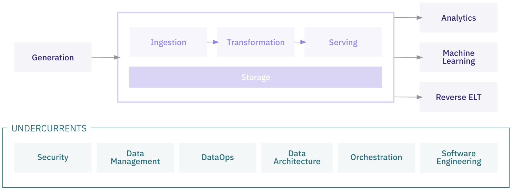
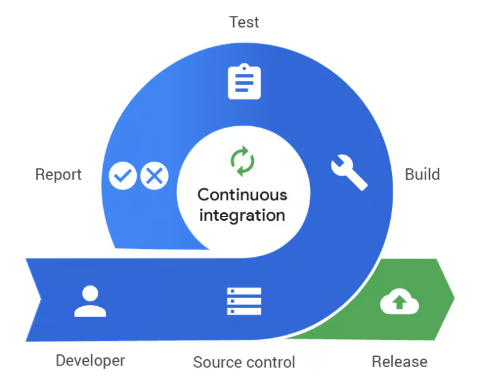

# Overviews of methodologies used in data-driven organisations
In the rapidly evolving landscape of data-driven decision-making, establishing a robust and efficient data platform is crucial for organizational success. This document presents an overview of the foundational concepts that underpin our data platform methodology. By embracing these principles, we aim to enhance our data engineering practices, streamline operations, and foster innovation. In some areas more technical details are described on a separate page, also with implementation examples.

This chapter focuses on the following key areas:

- **Data Engineering Lifecycle**: Understanding the end-to-end process of designing, building, and maintaining data systems to ensure data is reliable, accessible, and valuable.
- **Infrastructure as Code (IaC)**: Adopting code-based management of infrastructure to achieve consistency, scalability, and efficiency across our technological environments.
- **Continuous Integration and Continuous Deployment (CI/CD)**: Implementing practices that automate code integration and deployment, enabling faster delivery and higher quality in our data projects.
- **Cloud vs On-Premises Data Platforms**: Evaluating the benefits and considerations of cloud-based and on-premises solutions to determine the optimal approach for our data platform needs.
- **GitOps**:
- **Data Governance Framework**:
- **Agile Practices**:
- **DevOps integration**:
- **Release versioning**
- **SOPS**
- more TBD

By delving into these concepts, we aim to establish a common understanding that will guide our data platform initiatives and support organization's strategic objectives.

## Data Engineering Lifecycle
The Data Engineering Lifecycle encompasses the end-to-end process of designing, building, and maintaining data systems. It ensures that data is collected, processed, stored, and made accessible in a reliable and efficient manner.

We can divide the data engineering lifecycle into five stages: [[1]](https://www.oreilly.com/library/view/fundamentals-of-data/9781098108298/)
- Generation
- Storage
- Ingestion
- Transformation
- Serving data

Beginning of the data engineering lifecycle is the process of getting data from source systems and storing it. Later, data needs to be transformed in a way that will enable serving it to analysts, data scientists, and others. During all stages data needs to be stored somewhere, that's why on diagram storage "stage" is showed as a foundation that underpins other stages. Additionally, it's not always continuous flow, as ingestion and transformation can be mixed or repeated, depending on business needs.

All of these stages requires some processes that are helping with keeping proper structure for the whole flow, and they are undercurrents that cut across multiple stages of the data engineering lifecycle: security, data management, DataOps, data architecture, orchestration, and software engineering.

For more detailed explanation check [Data engineering lifecycle](lifecycle.md)

## Infrastructure as Code (IaC)
Infrastructure as Code is the practice of managing and provisioning infrastructure through machine-readable definition files, rather than physical hardware configuration or interactive configuration tools. Most important concepts are:
- **Declarative Configurations**: Desired state of infrastructure is defined in code, with no manual changes happening anywhere in infrastructure
- **Version Control**: Thanks to storing infrastructure code in repository (eg. Git), all changes are tracked.
- **Automation Tools**: With usage of tools like Terraform, Ansible or CloudFormation, provisioning is automated.

For MVP project, manually created infrastructure might be enough. As soon as the project is going into more mature phase, implementing IaC brings a lot of advantages, as the infrastructure is consistent across multiple environments. It's also much easier to scale the environment, as replication of infrastructure to accommodate growth is mostly handled by automation tools. While initial setup is more complex compared to manual implementation, in the long run the whole process is more efficient thanks to reduced manual configuration efforts and associated errors.

More information and example implementation can be found [on dedicated page](iac.md)

## Continuous Integration and Continuous Deployment (CI/CD)
CI/CD, an integral part of DevOps, brings development and operations teams together by streamlining continuous integration and continuous delivery. It automates most, if not all, of the manual steps traditionally required to push new code from commit to production. This includes phases like building, testing (unit, integration, and regression tests), deployment, and even infrastructure provisioning. By leveraging a well-configured CI/CD pipeline, development teams can seamlessly implement code changes that are automatically tested and deployed, reducing downtime and accelerating release cycles.

### Why is CI/CD important?
In today's fast-moving tech landscape, CI/CD is no longer just a buzzword—it’s a fundamental pillar of modern software development. By automating everything from code integration to deployment, CI/CD empowers teams to release features and fixes more quickly and frequently, making products more adaptable to user needs. Continuous integration and delivery catch errors early, minimizing downtime and boosting software quality. Additionally, faster feedback loops with stakeholders help ensure the final product meets user expectations. In short, CI/CD is essential for any team striving for rapid, high-quality development.

### What is Continuous Integration (CI)

Continuous Integration (CI) is a development practice where developers regularly merge their code changes into a shared repository. Each integration triggers an automated build and testing process, ensuring that code changes are continuously validated. This early and frequent testing helps catch errors or conflicts early, reducing integration issues and improving overall software quality. CI encourages collaboration and streamlines development by making sure that the codebase remains stable and deployable at all times.

### What is Continuous Deployment and Continuous Delivery
Continuous Delivery (CD) is the practice of automatically preparing code changes for release to production. After code passes all automated tests in the CI phase, it's packaged and ready for deployment. However, the final step—pushing the code to production—remains a manual decision. This ensures that the software is always in a deployable state, allowing teams to release updates frequently and reliably whenever they're ready.

Continuous Deployment, on the other hand, takes this process a step further by automating the entire release pipeline, including the deployment to production. Every change that passes automated tests is automatically pushed to live environments without human intervention. This enables faster release cycles and ensures that updates and new features are delivered to users as soon as they're ready.

For implementing CI/CD in the Data Engineering space, please check out [this page](cicd.md), where example of building CI/CD pipeline for application is shown, but also a way to implement such practices into data pipelines.

## Cloud vs On-Premises Data Platforms
TBD
