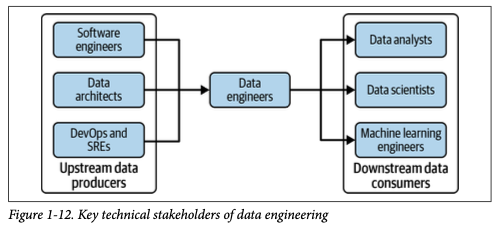

# Roles in Data-Driven Organizations

In modern organizations, various roles contribute to the design, development, and operation of data-driven systems. These roles collaborate to ensure that data flows smoothly through its lifecycle, from generation to consumption in analytics, machine learning, and business processes. Data engineers act as a crucial link between upstream data producers and downstream data consumers, enabling a seamless data engineering flow.

**Diagram Placeholder: Data engineering roles**

Below is an overview of the key roles and their responsibilities. A single person can take on multiple roles, but it's important to distinguish them within the broader organizational landscape.

---

### 1. **Software Engineers**

Software engineers focus on designing, developing, and maintaining applications that often act as data generators or consumers. Their primary responsibility is to build robust, scalable systems that integrate with the organization's data architecture.

#### Key Responsibilities:
- Building data-driven applications that interact with data pipelines.
- Developing APIs and services for data generation and consumption.
- Ensuring code quality, scalability, and maintainability.

**Key Interactions**: Work closely with data engineers to ensure smooth integration between application logic and data pipelines.

---

### 2. **Data Architects**

Data architects are responsible for designing the overall data architecture of the organization. They define how data is structured, stored, and accessed across the entire data ecosystem, ensuring that systems can scale efficiently while maintaining data quality and governance.

#### Key Responsibilities:
- Designing databases, data warehouses, and data lakes.
- Establishing data governance frameworks.
- Ensuring the scalability and security of the data architecture.

**Key Interactions**: Collaborate with data engineers, software engineers, and DevOps teams to implement scalable and efficient data storage and access solutions.

---

### 3. **DevOps and Site Reliability Engineers (SREs)**

DevOps engineers and SREs focus on the deployment, monitoring, and maintenance of the infrastructure that supports data pipelines and applications. They ensure that the systems are reliable, secure, and scalable, automating as many processes as possible.

#### Key Responsibilities:
- Managing the infrastructure for data processing and storage.
- Implementing CI/CD pipelines for data and software workflows.
- Monitoring system performance, uptime, and security.

**Key Interactions**: Work closely with data engineers, software engineers, and machine learning engineers to maintain the operational health of data systems.

---

### 4. **Data Engineers**

Data engineers are responsible for building and maintaining data pipelines that transport data across systems. They focus on automating the ingestion, transformation, and serving of data, ensuring it is reliable and accessible for analysis and decision-making.

#### Key Responsibilities:
- Designing and building scalable data pipelines.
- Automating data ingestion, transformation, and serving processes.
- Ensuring data quality and pipeline efficiency.

**Key Interactions**: Collaborate with data analysts, data scientists, software engineers, and DevOps teams to ensure data flows smoothly through the organization.

---

### 5. **Data Analysts**

Data analysts work with processed data to generate reports and insights that inform business decisions. They use statistical methods, business intelligence tools, and domain knowledge to create dashboards and reports that present key metrics and trends.

#### Key Responsibilities:
- Analyzing and interpreting data to generate actionable insights.
- Building dashboards and reports to track KPIs.
- Identifying trends and patterns in historical data.

**Key Interactions**: Work with data engineers and data scientists to access and analyze the data needed for reporting and insights.

---

### 6. **Data Scientists**

Data scientists apply statistical and machine learning techniques to extract insights from data and build models that predict future outcomes or optimize processes. They work with both structured and unstructured data to answer complex business questions.

#### Key Responsibilities:
- Building predictive models using statistical and machine learning methods.
- Conducting exploratory data analysis to uncover hidden patterns.
- Collaborating with machine learning engineers to deploy models into production.

**Key Interactions**: Collaborate with data engineers, analysts, and machine learning engineers to ensure access to clean data and the smooth deployment of models.

---

### 7. **Machine Learning Engineers**

Machine learning engineers focus on deploying and maintaining machine learning models in production environments. They ensure that models are properly integrated with data pipelines, are scalable, and can be monitored and updated as needed.

#### Key Responsibilities:
- Deploying machine learning models into production.
- Managing model versioning and monitoring performance.
- Optimizing models for efficiency and scalability.

**Key Interactions**: Work closely with data scientists, data engineers, and DevOps to ensure models are scalable, reliable, and performant.

---

## Conclusion

Each of these roles plays a crucial part in the overall success of a data-driven organization. From generating and transforming data to analyzing and deploying models, the collaboration between these roles ensures that data flows seamlessly through every stage of the lifecycle, enabling businesses to harness the full power of their data assets.
